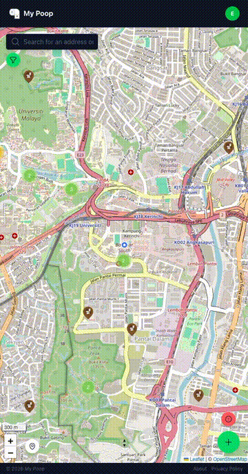
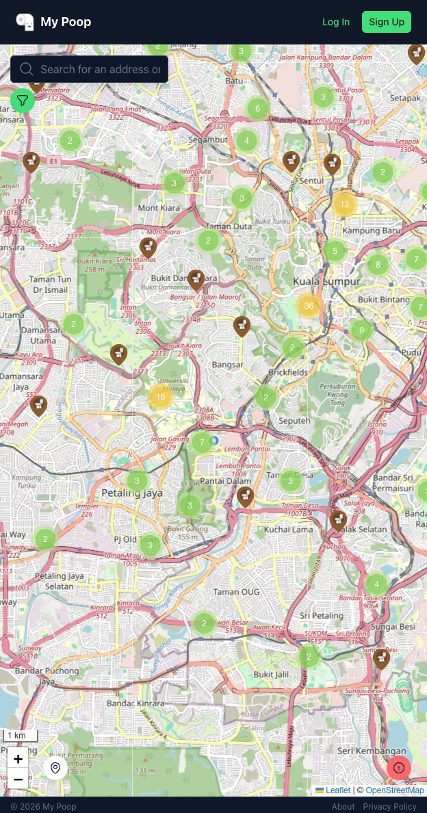
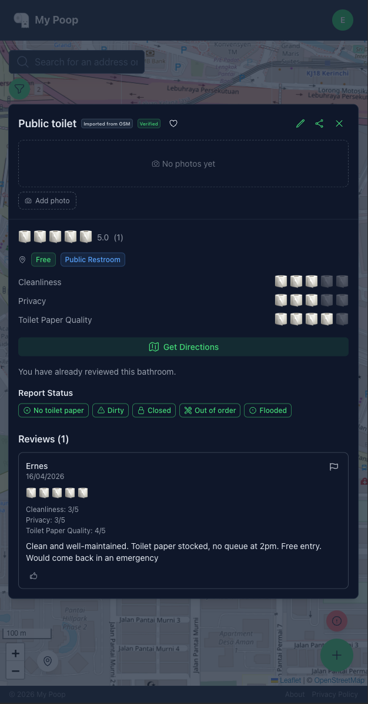
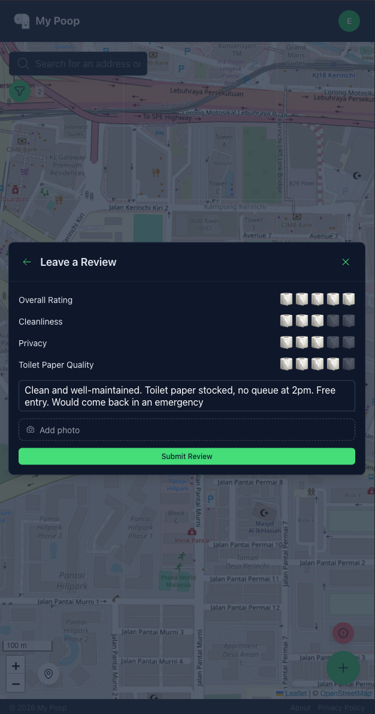
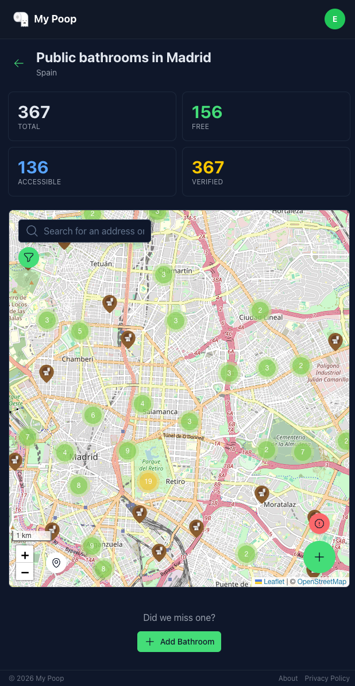
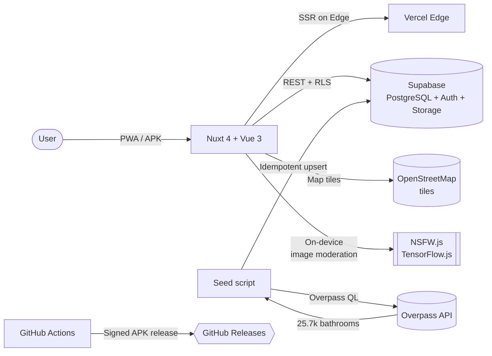

<p align="center">
  
</p>

<h1 align="center">My Poop</h1>

<p align="center">
  <strong>The community-driven public bathroom map you actually needed.</strong>
  <br />
  Find, rate and review bathrooms with the details that matter when you can't wait.
</p>

<p align="center">
  <a href="https://my-poop.vercel.app"><strong>Try it now →</strong></a> &nbsp;·&nbsp;
  <a href="https://github.com/evivar/my-poop/releases/latest">Android APK</a> &nbsp;·&nbsp;
  <a href="https://my-poop.vercel.app/about">About</a> &nbsp;·&nbsp;
  <a href="#contributing">Contribute</a>
</p>

<p align="center">
  
  
  
  
  
</p>

---

## By the numbers

<table width="100%">
  <tr>
    <td align="center" width="33%">
      <h1>25,700+</h1>
      <sub><b>BATHROOMS</b></sub>
    </td>
    <td align="center" width="33%">
      <h1>84</h1>
      <sub><b>CITIES</b></sub>
    </td>
    <td align="center" width="33%">
      <h1>40+</h1>
      <sub><b>COUNTRIES</b></sub>
    </td>
  </tr>
</table>

<p align="center"><em>…and growing every week.</em></p>

## Top cities

<table align="center">
  <tr>
    <th align="left">City</th>
    <th align="left">Country</th>
    <th align="right">Bathrooms</th>
  </tr>
  <tr><td>Nairobi</td><td>Kenya</td><td align="right"><b>2,200+</b></td></tr>
  <tr><td>Tokyo</td><td>Japan</td><td align="right"><b>1,550+</b></td></tr>
  <tr><td>Paris</td><td>France</td><td align="right"><b>1,070+</b></td></tr>
  <tr><td>Berlin</td><td>Germany</td><td align="right"><b>890+</b></td></tr>
  <tr><td>Singapore</td><td>Singapore</td><td align="right"><b>818+</b></td></tr>
  <tr><td>Madrid</td><td>Spain</td><td align="right"><b>367+</b></td></tr>
</table>

<p align="center">
  <em>Don't see your city? <a href="https://github.com/evivar/my-poop/issues/new">Open an issue</a> and it'll be seeded next.</em>
</p>

## The story

**Hi, I'm [Ernesto](https://github.com/evivar)** — a software engineer from Spain, currently based in Kuala Lumpur. I've spent years building web apps with Vue, Nuxt and TypeScript. My Poop is the solo side project I wish someone else had built first.

> Picture this: it's 35 °C in KL. You ate something adventurous at a street market. And you <strong>REALLY</strong> need to go.
>
> You open Google Maps — there's a pin. But is it clean? Is it free? Does it even still exist?
>
> Three apps later, you're still clenching. 🧻

**That's why I built My Poop.** A bathroom map that tells you what actually matters — cleanliness, privacy, toilet paper, accessibility — with real reviews from real people. Free. No ads. No tracking. No asking you to "create an account to continue".

<p align="center">
  
  <br />
  <em>SOS button — nearest bathroom in one tap. No signup.</em>
</p>

## Screenshots

<p align="center">
  &nbsp;
  &nbsp;
  &nbsp;
  
</p>

## What you can do

### As a user

- **Find fast** — interactive map with clustering, search, and filters (type, free, accessible, rating)
- **SOS button** — one tap finds the nearest bathroom, no login required
- **Real reviews** — rate cleanliness, privacy, and toilet paper quality on a 1–5 🧻 roll scale
- **Status reports** — mark bathrooms as "dirty", "no paper", or "closed" so others know what to expect
- **City pages** — landing pages for every city with stats and top picks (e.g. [/city/madrid](https://my-poop.vercel.app/city/madrid))
- **Photos** — upload and browse community photos with on-device NSFW detection
- **Favorites, share, directions** — save your regulars, share a bathroom with friends, open in Google or Apple Maps in one tap
- **Install anywhere** — PWA from any browser, Android APK, or iOS home screen shortcut
- **Dark mode and bilingual** — English and Spanish, dark by default

### As a contributor

- **Add missing bathrooms** in your city directly from the app
- **Edit OSM data** — improve imported bathrooms (name, hours, accessibility) without leaving the app

## Why not just Google Maps?

- **Google shows *where* a bathroom is. My Poop shows *how it is*** — cleanliness, privacy, toilet paper, accessibility. The stuff Google won't tell you.
- **No signup to browse.** Google Maps is tied to your identity. My Poop is anonymous by default — nobody knows what you're searching, not even me.
- **Hidden bathrooms.** The ones behind a gas station counter, inside a mosque, in a public park that never made it onto Google. OSM and the community do have them.
- **Real-time status.** Flag a bathroom as "no paper", "dirty" or "closed" so the next person knows before they open the door.
- **Medical emergencies deserve better than a lottery.** For people with Crohn's, UC or IBS, "the nearest pin" isn't good enough. Filters for "no purchase required" and "accessible" are coming, and are being shaped by the community that actually needs them.

## Try it

| Platform    | How                                                                                        |
| ----------- | ------------------------------------------------------------------------------------------ |
| **Web**     | [my-poop.vercel.app](https://my-poop.vercel.app) — works on any modern browser             |
| **Android** | Download the signed APK from [Releases](https://github.com/evivar/my-poop/releases/latest) |
| **iOS**     | Open the web app in Safari → Share → **Add to Home Screen**                                |

No account required to browse. No ads. No tracking. Ever.

## Tech stack

| Layer          | Technology                                |
| -------------- | ----------------------------------------- |
| Frontend       | Vue 3, Nuxt 4, TypeScript                 |
| UI             | Nuxt UI v4, Tailwind CSS                  |
| Map            | Leaflet + MarkerCluster                   |
| Backend        | Supabase (PostgreSQL, Auth, Storage, RLS) |
| Data           | OpenStreetMap (Overpass API)              |
| Hosting        | Vercel (Edge, Analytics)                  |
| Mobile         | Capacitor (Android), PWA (iOS)            |
| Content safety | NSFW.js (TensorFlow)                      |

## Architecture



The whole stack runs on free tiers. The seed script is idempotent — re-running it never creates duplicates thanks to a partial unique index on `osm_id`.

## Getting started

### Prerequisites

- Node.js >= 22
- npm
- A [Supabase](https://supabase.com) project (free tier is enough)

### Setup

```bash
git clone https://github.com/evivar/my-poop.git
cd my-poop
npm install

cp .env.example .env
# Fill in SUPABASE_URL and SUPABASE_KEY

npm run dev
```

### Seed bathrooms from OpenStreetMap

```bash
npm run seed:osm          # All 84 cities
npm run seed:osm madrid   # Single city
```

## How to contribute

Pick your time budget:

| Time | What you can do |
| --- | --- |
| **30 seconds** | ⭐ [Star the repo](https://github.com/evivar/my-poop) so others can find it |
| **2 minutes** | [Add a bathroom](https://my-poop.vercel.app) from your city directly in the app |
| **10 minutes** | Report a bug or suggest a feature in [Issues](https://github.com/evivar/my-poop/issues/new) |
| **1 hour** | Seed a new city: `npm run seed:osm <city>` and open a PR |
| **An afternoon** | Pick a [good first issue](https://github.com/evivar/my-poop/contribute) |

Not a dev? The most valuable contribution is adding bathrooms you know of — the ones tourists will never find on Google.

## Star history

<a href="https://star-history.com/#evivar/my-poop&Date">
  
</a>

## Acknowledgments

- **[OpenStreetMap contributors](https://www.openstreetmap.org/copyright)** for the bathroom data
- **[Leaflet](https://leafletjs.com)** for the map engine
- **[Supabase](https://supabase.com)** for the backend
- **[NSFW.js](https://github.com/infinitered/nsfwjs)** for client-side content moderation
- **[Nuxt](https://nuxt.com)** and **[Nuxt UI](https://ui.nuxt.com)** for the framework and components

## License

[MIT](LICENSE) — free for personal and commercial use.

Map data © OpenStreetMap contributors, available under the [Open Database License (ODbL)](https://opendatacommons.org/licenses/odbl/).

## Stay in touch

Built because finding a decent bathroom while traveling shouldn't require three apps and a prayer. Feedback, ideas and pull requests are always welcome.

[GitHub @evivar](https://github.com/evivar) · [About page](https://my-poop.vercel.app/about) · [Open an issue](https://github.com/evivar/my-poop/issues/new)
